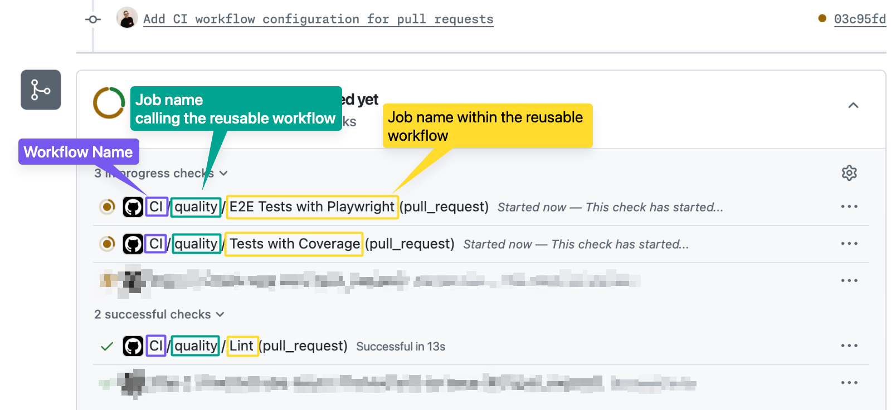

## Step 2: Let's use the reusable workflow!

Nice! You've now created a reusable workflow and you're ready to use it 🚀

In this step, you'll create a caller workflow that runs on pull requests and delegates quality checks to that reusable workflow.

### 📖 Theory: How to use reusable workflows?

Reusable workflows can be called from the same repository (as we will do in this exercise), but you can also call reusable workflows from other repositories to share standards across teams.

| Reusable workflow location | Reference format | Typical use case |
| -------------------------- | ---------------- | ---------------- |
| Same repository            | `./.github/workflows/reusable-node-quality.yml` | Reuse logic across multiple workflows in the same repository |
| Different repository       | `owner/repo/.github/workflows/workflow.yml@v1` | Share standards across many repositories in an organization |


> [!IMPORTANT]
> When using a reusable workflow from another repository, pin to a stable tag or commit SHA for predictable behavior and better security.

### ⌨️ Activity: Create a CI workflow and call your reusable workflow

Let's start working on our CI workflow that will run on pull requests and call the reusable workflow you created in the previous step.

1. In your codespace, within the `.github/workflows` directory create a new workflow file named:

   ```text
   ci.yml
   ```

1. Within that file copy the following workflow content:

   ```yaml
   name: CI

   on:
     pull_request:
       branches:
         - main

   permissions:
     contents: read

   jobs:
     quality:
       uses: ./.github/workflows/reusable-node-quality.yml
       with:
         node-version: 24
   ```

   This workflow will run on every pull request change targeting `main` and will call the reusable workflow you created in the previous step.

   > ✨ A lot cleaner, isn't it? If your node quality checks are standardized across many repositories, you can call this reusable workflow from all of them and maintain it in one place!

1. Commit and push your `ci.yml` changes to the `reusable-workflows` branch.

### ⌨️ Activity: See your reusable workflow in action

Let's see your workflow running by opening a pull request!

1. In another browser tab, navigate to the [Pull requests](https://github.com/{{ full_repo_name}}/pulls) section of your repository.

1. Open a new pull request from the `reusable-workflows` branch to `main`.
   > ⚠️ **Warning:** Do not merge this pull request yet. You will keep working on this same pull request in the next step.

1. As you scroll down, you may need to expand the **Checks** section. Then you will see the CI workflow running three separate jobs in detail.

    

   > 💡 You will also see some additional checks with names like `Step ...`. Those checks are used to run this exercise, so you don't need to worry about them. If one of those checks fails, come back to this issue and review Mona's feedback.

1. With the pull request open Mona will prepare the next step in this exercise or provide some feedback!
