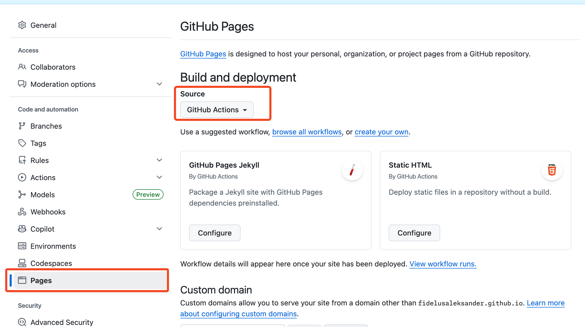

## Step 3: Add permissions-aware deployment and PR feedback

Great progress! You already call your reusable quality workflow from `ci.yml`.

In this final step, you'll expand your CI workflow with more functionalities that will require you to understand workflow permissions.

Also we will deploy **Octomatch** to GitHub Pages!

### 📖 Theory: How permissions pass to reusable workflows

When a workflow calls a reusable workflow, token permissions are inherited and can only stay the same or become more restrictive.

Reusable workflows can be nested and each level inherits from its direct caller, not from the original top-level workflow.

| Where permissions are set      | What it controls                                                                 | Can permissions be expanded here? |
| ------------------------------ | -------------------------------------------------------------------------------- | --------------------------------- |
| Caller workflow (e.g `ci.yml`) | The permission ceiling available to all called workflows and their jobs          | Yes (sets the upper limit)        |
| Called reusable workflow       | How permissions are scoped for its own jobs and any downstream reusable calls    | No, only same or narrower         |
| Nested reusable workflow calls | The inherited permission ceiling passed from the direct parent reusable workflow | No, only same or narrower         |

### ⌨️ Activity: Enable Github Pages for the repository

In the following activity we will expand the `CI` workflow that will deploy **Octomatch** to GitHub Pages. Before we can do that, we need to enable GitHub Pages for this repository.

1. Go to your repository [settings](https://github.com/{{ full_repo_name }}/settings).
1. In the left sidebar click on `Pages`
1. Under `Source` select `GitHub Actions`



Now you are ready to add a deployment job to your workflow that will deploy the app to GitHub Pages on every pull request!

### ⌨️ Activity: Add deployment and PR comment jobs to your workflow

Our next goal is to deploy the app and post the deployed page URL on the pull request.

A reusable workflow called `deploy-pages.yml` is already present in the `.github/workflows` directory. It deploys the app to GitHub Pages and outputs the page URL

Let's use that!

1. Open `.github/workflows/ci.yml`.
1. Let's include another job in the `ci.yml` workflow that will call the `deploy-pages.yml` reusable workflow.

   Add the following job to the end of `ci.yml` file:

   ```yaml
   github-pages:
     name: Deploy to GitHub Pages
     needs: quality
     uses: ./.github/workflows/deploy-pages.yml
     with:
       node-version: "24"
     permissions:
       contents: read
       pages: write
       id-token: write
   ```

   The `needs` keyword ensures this job will run only after the `quality` job succeeds.

   The `permissions` block is used to override and expand the permissions for this job beyond the default `contents: read` permissions set at the workflow level.

1. Add another job that will use the `page_url` output of the `github-pages` job to comment on the pull request.

   Add the following job to `ci.yml`:

   ```yaml
   comment:
     name: Comment on PR
     if: always()
     needs: github-pages
     runs-on: ubuntu-latest
     permissions:
       pull-requests: write
     steps:
       - name: Comment with Pages URL
         uses: GrantBirki/comment@v2.1.1
         with:
           issue-number: ${{ github.event.pull_request.number }}
           body: |
             | Item | Link |
             | --- | --- |
             | 🌐 GitHub Pages URL | ${{ needs.github-pages.outputs.page_url }} |
             | 🧾 Workflow logs | https://github.com/${{ github.repository }}/actions/runs/${{ github.run_id }} |
   ```

   The `if: always()` condition ensures that the comment job runs even if the deployment fails, so we can have visibility on the workflow logs in that case.

### ⌨️ Activity: Verify, commit and push your changes

We've done a lot of work in this step! The YAML indentation can be tricky, so let's first use `actionlint` to verify there are no syntax errors in our workflow files!

1. In your terminal, run the following command to check for any syntax errors in your `ci.yml` workflow file:

   ```bash
   actionlint .github/workflows/ci.yml
   ```

   Or to check all workflow files:

   ```bash
   actionlint
   ```

   If there are any errors, fix them before proceeding.

1. Commit and push your `ci.yml` changes to the `reusable-workflows` branch.
1. Monitor the `CI` workflow running on your pull request and wait for it to fully complete.
1. Once it's done you should see a new comment on your pull request with the GitHub Pages URL where you can play **Octomatch**!
1. When the `CI` workflow completes Mona will be notified to check your progress and provide a review!
